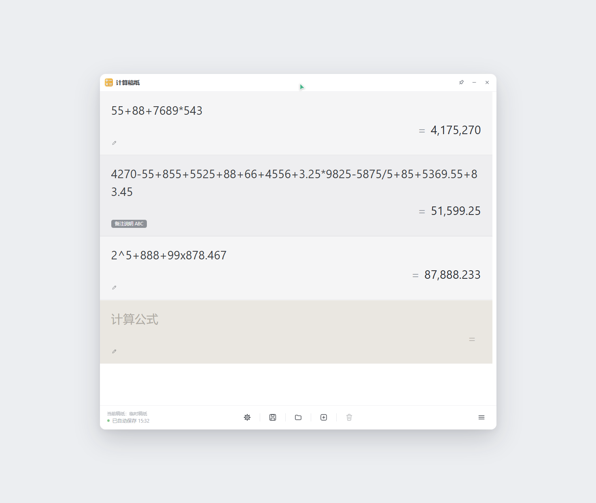
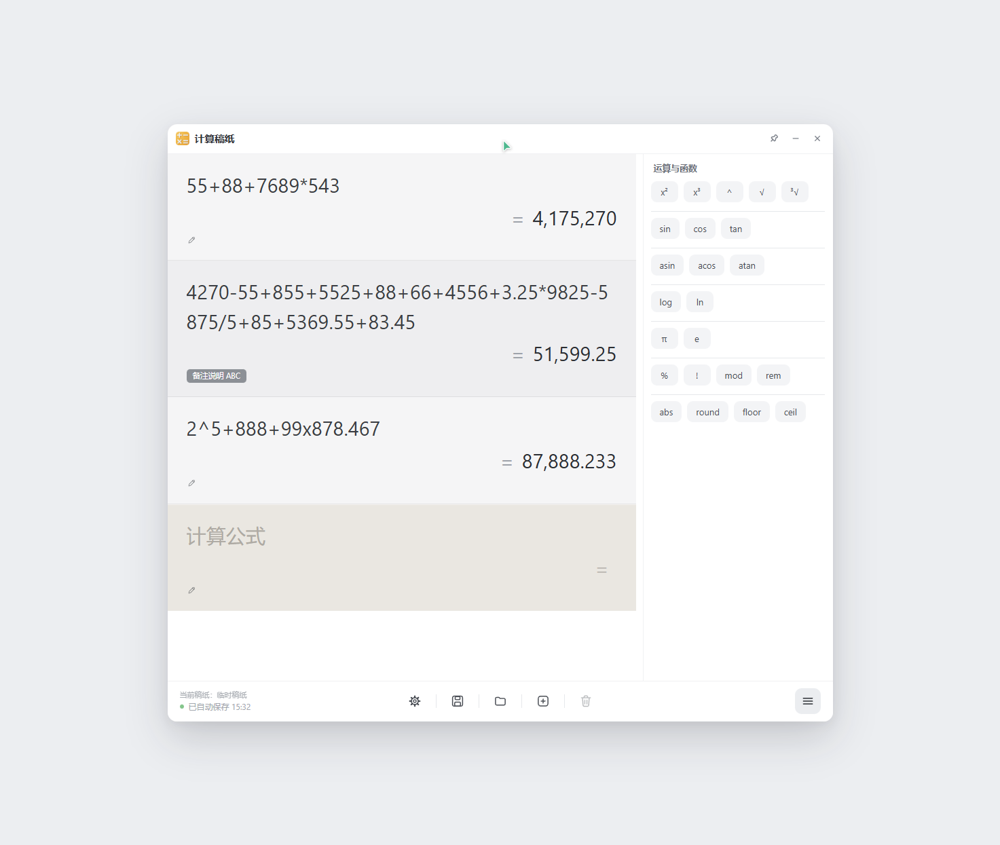
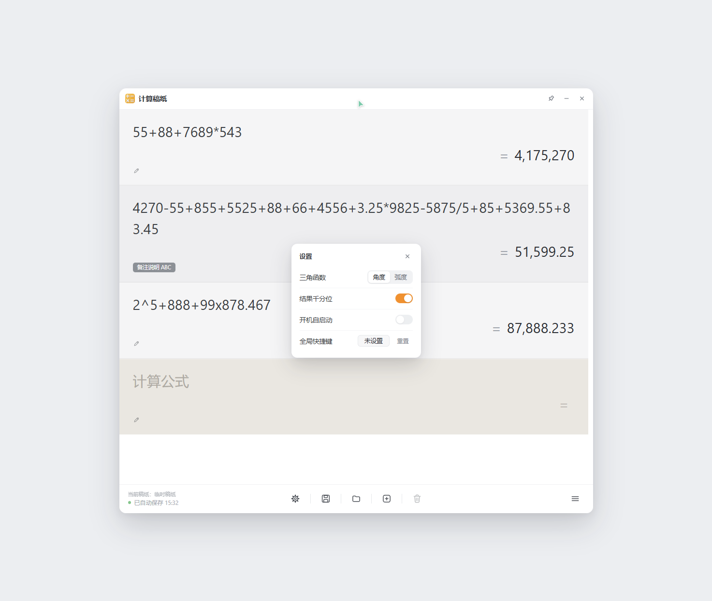
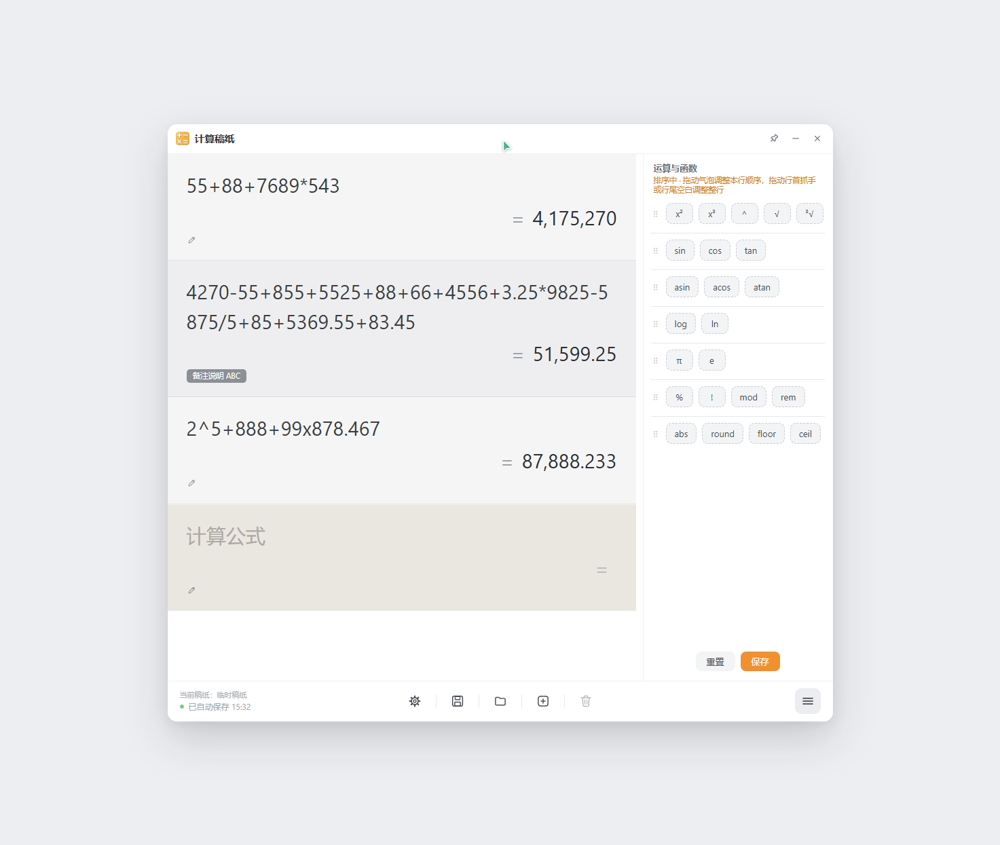

# 计算稿纸 · CalcPaper
**简体中文** | [**English**](README_EN.md)

> 像稿纸一样逐行记算的 Windows 计算器 —— 每行一个算式，边打边出结果，回车把结果接力到下一行。


|                   主界面                   |                运算菜单（抽屉）               |
| :-------------------------------------: | :-----------------------------------: |
|     |  |
|  |  |

## 目录

1. [简介](#1-简介)
2. [特色功能](#2-特色功能)
3. [基础功能](#3-基础功能)
4. [操作使用说明](#4-操作使用说明)
5. [支持的运算符号、函数与常量](#5-支持的运算符号函数与常量)
6. [运算符优先级](#6-运算符优先级)
7. [结果格式化与错误提示](#7-结果格式化与错误提示)
8. [技术栈与运行环境](#8-技术栈与运行环境)
9. [两种打包版本与适用范围](#9-两种打包版本与适用范围)
10. [下载与安装](#10-下载与安装)
11. [从源码构建](#11-从源码构建)
12. [目录结构](#12-目录结构)
13. [数据与隐私](#13-数据与隐私)
14. [常见问题（FAQ）](#14-常见问题faq)
15. [已知限制](#15-已知限制)
16. [版本与更新日志](#16-版本与更新日志)
17. [贡献与反馈](#17-贡献与反馈)
18. [鸣谢](#18-鸣谢)
19. [许可证](#19-许可证)

## 1. 简介

「计算稿纸」是一款 Windows 桌面计算器，界面就是一张**条格纸**：每一行都能写一条算式并**实时算出结果**，按 `Enter` 结算当前行并把结果**接力**到下一行，像在纸上连续推导一样自然。

它**便携免安装**（解压即用）、**完全离线**（不联网、无遥测、无账号），所有数据只落在程序目录下的 `data\` 里，不写 `%APPDATA%`、不写注册表（开机自启动除外）。

## 2. 特色功能

- **逐行即时求值** —— 每行一条独立算式，边输入边出结果；长算式自动换行、行高自适应，不出现内部滚动条。

- **结果接力** —— `Enter` 把本行结果填进下一行（复制的是纯数值，不带千分位），天然支持连续多步计算。

- **运算菜单抽屉** —— 右下角菜单键展开 23 个运算 / 函数气泡，点一下按**光标位置**插入，函数类自动把光标送进括号。

- **符号可排序** —— 抽屉内右键 →「符号排序」，可拖动调行内顺序、拖行首抓手调整整行顺序，支持「重置 / 保存」，顺序持久化。

- **行备注** —— 任意一行都能挂一条备注，点在铅笔图标输入，收起后是灰色胶囊。

- **双击复制** —— 双击结果即复制纯数值，并在鼠标处弹出「已复制」气泡。

- **桌面级顺手** —— 窗口置顶、关闭即隐藏到托盘、全局快捷键唤醒、开机静默自启动、单实例运行。

- **输入容错** —— `× ÷ （） ＋ － ＾ π √ ∛` 等全角与别名符号、字母 `x` 当乘号、任意空白都能直接吃下。

- **零依赖前端** —— 界面与计算引擎是原生 HTML/CSS/JavaScript（ES5 风格、无框架、无第三方库），引擎有 127 条自测用例。

## 3. 基础功能

界面分三个区域：**标题栏**（置顶 / 最小化 / 关闭到托盘）、**工作区**（条格纸 + 运算菜单抽屉）、**底栏**（当前稿纸文件名 + 自动保存状态 + 功能按钮）。

| 功能    | 说明                                 |
| ----- | ---------------------------------- |
| 条格纸录入 | 每行一条算式，实时求值并显示在右侧 `=` 之后           |
| 结果接力  | `Enter` 结算当前行，数值带入下一行作为起算点         |
| 行备注   | 每行可挂一条备注，不参与计算                     |
| 结果复制  | 双击结果复制纯数值                          |
| 运算菜单  | 23 个符号气泡，点击插入当前行光标处                |
| 符号排序  | 拖动调整符号顺序与分组行顺序，可重置为默认              |
| 稿纸管理  | 自动保存、另存为、加载、新建、删除（走回收站）            |
| 状态提示  | 底栏显示当前稿纸文件名与「已自动保存 HH:mm」，异常时变红字   |
| 设置    | 三角函数角度 / 弧度、结果千分位、开机自启动、全局快捷键      |
| 桌面集成  | 窗口置顶、隐藏到托盘、全局快捷键唤醒、单实例、开机静默启动、启动动画 |

**运算菜单的 23 个气泡**（默认顺序，分 7 行）：

| 分组   | 气泡                           |
| ---- | ---------------------------- |
| 幂与根  | `x²` `x³` `^` `√` `³√`       |
| 三角   | `sin` `cos` `tan`            |
| 反三角  | `asin` `acos` `atan`         |
| 对数   | `log` `ln`                   |
| 常量   | `π` `e`                      |
| 运算   | `%` `!` `mod` `rem`          |
| 通用函数 | `abs` `round` `floor` `ceil` |

## 4. 操作使用说明

### 操作速查

| 操作          | 入口 / 按键                         | 说明                                                                   |
| ----------- | ------------------------------- | -------------------------------------------------------------------- |
| 输入算式        | 点击任意一行直接输入                      | 边输入边求值，当前行浅底高亮并显示「计算公式」占位                                            |
| 结算并带入下一行    | `Enter`                         | 结果填进下一行；空行或算式有错时不动、不新建                                               |
| 行间切换        | `↑` / `↓`                       | 跳到上一行 / 下一行，光标落在文本末尾                                                 |
| 添加 / 编辑备注   | 行内铅笔图标 → 输入框 / 点灰色胶囊            | `Enter` 保存，`Esc` 取消                                                  |
| 复制结果        | 双击结果区                           | 复制纯数值（无千分位），弹出「已复制」气泡                                                |
| 展开 / 收起运算菜单 | 底栏最右的三横杠按钮                      | 单击即开合；抽屉宽 280px，**推开**稿纸而非遮挡                                         |
| 插入符号        | 点击抽屉里的气泡                        | 插入到光标处；函数类自动把光标放进括号内                                                 |
| 调整符号顺序      | 抽屉内右键 →「符号排序」                   | 拖动气泡调行内顺序；拖行首抓手或行尾空白调整整行；底部「重置 / 保存」                                 |
| 打开设置        | 底栏齿轮按钮                          | `Esc` 或点击面板外部收起                                                      |
| 另存稿纸        | 底栏「另存稿纸」                        | 保存为 `*.json`，默认文件名 `计算稿纸.json`                                       |
| 加载稿纸        | 底栏「加载稿纸」                        | 载入后替换当前全部内容并聚焦最后一行                                                   |
| 新建稿纸        | 底栏「新建稿纸」                        | 当前未绑定文件时会先弹应用内确认，可直接「另存为」；确认后回到「临时稿纸」                                |
| 删除稿纸        | 底栏「删除稿纸」                        | 仅在已绑定文件时可用；文件进回收站（可恢复），界面回到临时稿纸                                      |
| 窗口置顶        | 标题栏图钉按钮                         | 切换置顶，状态由窗口回执同步                                                       |
| 最小化         | 标题栏 `—`                         | 常规最小化                                                                |
| 关闭到托盘       | 标题栏 `×`                         | **不退出程序**，图标留在托盘                                                     |
| 重新显示窗口      | 托盘图标左键单击                        | 或使用全局快捷键                                                             |
| 完全退出        | 托盘图标右键 →「完全退出」                  | 退出前会先落盘                                                              |
| 唤醒窗口        | 全局快捷键（默认 `Alt+C`），或设置里录制的「双击某键」 | `Alt` / `Ctrl` / `Shift` / `Win`、`F1`–`F12`、`CapsLock`、`Tab` 均可作为双击键 |
| 最小化到任务栏     | `Alt+F4`                        | 捕获后最小化，不退出                                                           |
| 缩放窗口        | 拖拽**右边线 / 下边线 / 右下角**           | 有意只开放这三处：上边线与左上角拖拽会移动窗口原点、造成内容抖动，故禁用                                 |

### 三条使用要点

1. **连续计算**：第 1 行输入 `1000*1.13`，按 `Enter`，第 2 行自动带上 `1130`，接着写 `-250` 继续算。
2. **抽屉插入**：把光标停在行内需要的位置，再点气泡；`sin`、`log` 这类会插入 `sin()` 并把光标放在括号中间，直接敲参数即可。
3. **备注不参与计算**：备注只是贴在行下的说明文字，算式与备注都为空的行才会被当作空白行回收。

## 5. 支持的运算符号、函数与常量

### 运算符

| 符号      | 含义                            | 输入样例            | 结果         |
| ------- | ----------------------------- | --------------- | ---------- |
| `+` `-` | 加、减（也作一元正负号）                  | `12-3.5`        | 8.5        |
| `*`     | 乘（别名 `×` `✕` `✖` `x` `X` `＊`） | `99x878.467`    | 86,968.233 |
| `/`     | 除（别名 `÷` `／`）                 | `5875/5`        | 1,175      |
| `^`     | 幂，右结合                         | `(1+2)*(3+4)^2` | 147        |
| `%`     | 写在两个数之间 = 取模；写在数后 = 百分比       | `10%3` / `50%`  | 1 / 0.5    |
| `!`     | 后缀阶乘（仅非负整数，上限 170）            | `5!`            | 120        |
| `(` `)` | 括号分组，支持嵌套                     | `(1+2)*3`       | 9          |
| `,`     | 函数参数分隔                        | `log(2,8)`      | 3          |

### 函数（都必须带括号）

| 函数                            | 说明                           | 输入样例                        | 结果                |
| ----------------------------- | ---------------------------- | --------------------------- | ----------------- |
| `sqrt(x)` / `√(x)`            | 平方根（负数报「无法计算」）               | `sqrt(16)` / `√(2)`         | 4 / 1.41421356237 |
| `cbrt(x)` / `∛(x)`            | 立方根，**支持负数**                 | `cbrt(-8)`                  | -2                |
| `sin(x)` `cos(x)` `tan(x)`    | 正弦 / 余弦 / 正切，按设置的**角度制或弧度制** | `sin(30)`（角度制）              | 0.5               |
| `asin(x)` `acos(x)` `atan(x)` | 反正弦 / 反余弦 / 反正切，结果随当前角度制     | `asin(0.5)`（角度制）            | 30                |
| `arcsin` `arccos` `arctan`    | 上一行的别名                       | `arctan(1)`（角度制）            | 45                |
| `ln(x)`                       | 自然对数                         | `ln(e)`                     | 1                 |
| `log(x)`                      | 常用对数（以 10 为底）                | `log(100)`                  | 2                 |
| `log(b,x)`                    | 指定底数的对数                      | `log(2,8)`                  | 3                 |
| `abs(x)`                      | 绝对值                          | `abs(-3.5)`                 | 3.5               |
| `round(x)`                    | 四舍五入（恰好 .5 时远离 0）            | `round(-2.5)`               | -3                |
| `floor(x)` `ceil(x)`          | 向下 / 向上取整                    | `floor(-2.1)` / `ceil(2.1)` | -3 / 3            |
| `mod(a,b)`                    | 取模，结果符号**随除数**               | `mod(-7,3)`                 | 2                 |
| `rem(a,b)`                    | 取余，结果符号**随被除数**              | `rem(-7,3)`                 | -1                |

### 数字常量

| 常量         | 含义   | 输入样例          | 结果                            |
| ---------- | ---- | ------------- | ----------------------------- |
| `pi` / `π` | 圆周率  | `pi` / `2*π`  | 3.14159265359 / 6.28318530718 |
| `e`        | 自然常数 | `e` / `ln(e)` | 2.71828182846 / 1             |

### 输入容错（可直接粘贴各种写法）

| 你输入的                     | 引擎按此理解              |
| ------------------------ | ------------------- |
| `×` `✕` `✖` `x` `X` `＊`  | 乘号 `*`              |
| `÷` `／`                  | 除号 `/`              |
| `（` `）` `＋` `－` `＾`      | `(` `)` `+` `-` `^` |
| `−`（Unicode 数学减号 U+2212） | `-`                 |
| `π`                      | 常量 `pi`             |
| `√(x)`                   | 函数 `sqrt(x)`        |
| `∛(x)`                   | 函数 `cbrt(x)`        |
| 半角空格、全角空格、Tab、不换行空格等     | 一律忽略                |

### 不支持

变量与赋值、方程求解、矩阵 / 行列式、复数、统计函数、单位换算、求和 `Σ` / 积分、自定义函数、`n` 次根专用符号（用 `x^(1/n)` 代替）。

## 6. 运算符优先级

优先级由**低到高**排列：

|  优先级  | 运算          | 结合性   | 说明            |
| :---: | ----------- | ----- | ------------- |
| 1（最低） | `+` `-`     | 左     | 二元加减          |
|   2   | `*` `/` `%` | 左     | 乘、除，以及两数之间的取模 |
|   3   | 一元 `+` `-`  | 右     | 正负号           |
|   4   | `^`         | **右** | 幂；连续出现时从右往左算  |
|   5   | 后缀 `!` `%`  | 左     | 阶乘、百分比，可连写    |
| 6（最高） | 函数、括号、常量、数字 | —     | 分组与取值         |

### 优先级示例

| 表达式        | 结果     | 为什么                         |
| ---------- | ------ | --------------------------- |
| `1+2*3`    | 7      | 乘高于加                        |
| `(1+2)*3`  | 9      | 括号最高                        |
| `2+3*4`    | 14     | 乘高于加                        |
| `-2^2`     | -4     | 幂高于一元负号，即 `-(2^2)`          |
| `2^-1`     | 0.5    | 指数可以带负号                     |
| `2^3^2`    | 512    | `^` 右结合，即 `2^(3^2)`         |
| `2*3!`     | 12     | 阶乘高于乘                       |
| `2^3!`     | 64     | 阶乘绑定高于幂，即 `2^(3!)`          |
| `5!^2`     | 14,400 | 即 `(5!)^2`                  |
| `-3!`      | -6     | 即 `-(3!)`                   |
| `log(2,8)` | 3      | 函数与括号最先算                    |
| `10%3`     | 1      | `%` 后接数字 → 取模               |
| `10%`      | 0.1    | `%` 在数后 → 百分比               |
| `50%*2`    | 1      | 先算 0.5，再乘 2                 |
| `7%-3`     | -2.93  | 先算 `7%` = 0.07，再减 3         |
| `200+10%`  | 200.1  | 百分比即「除以 100」，**不**是「加价 10%」 |

### `%` 的双重身份

同一个 `%` 号按**它右边是什么**来决定含义：

- 右边紧跟**数字、常量（`π`/`pi`/`e`）或左括号** → 两侧都有操作数 → **取模**：`10%3` = 1、`(10%)%3` = 0.1

- 其余情况（右边是运算符、右括号、逗号、函数名或表达式结束）→ **后缀百分比**：`10%` = 0.1、`50%*2` = 1、`10%+3` = 3.1

### 两个易踩的坑

- **函数必须带括号**：`sin30`、`log 100`、`mod(1)` 都会报「表达式错误」；正确写法是 `sin(30)`、`log(100)`、`mod(2,8)`。

- **`√`** **/** **`∛`** **也是函数**：写作 `√(16)`、`∛(-8)`，不能写成 `√16`。

## 7. 结果格式化与错误提示

### 结果显示规则

| 规则                     | 输入样例                   | 显示结果                      |
| ---------------------- | ---------------------- | ------------------------- |
| 千分位（默认开启，可在设置中关闭）      | `1000000`              | 1,000,000（关闭后为 `1000000`） |
| 绝对值 ≥ 1e15 用科学计数法      | `10^21`                | 1e+21                     |
| 阈值以下仍用普通写法并分组          | `10^14`                | 100,000,000,000,000       |
| 非零且绝对值 < 1e-9 用科学计数法   | `10^-10`               | 1e-10                     |
| 1e-9 \~ 1e-6 之间展开为小数   | `10^-7`                | 0.0000001                 |
| 12 位有效数字归整，消除浮点尾巴      | `0.1+0.2`              | 0.3                       |
| 去掉小数尾随零、负零显示为 0        | `4.500` / `-0`         | 4.5 / 0                   |
| 三角函数整 90° 倍角的浮点残差吸附为 0 | `cos(90)` / `sin(180)` | 0 / 0                     |

> 计算基于 IEEE 754 双精度浮点，结果统一按 12 位有效数字归整，因此 `170!` 会显示为 `7.25741561531e+306` 而非一长串数字。

### 错误提示

| 情况                           | 输入样例                                | 界面提示                   |
| ---------------------------- | ----------------------------------- | ---------------------- |
| 空行                           | （空）                                 | 只显示 `=`                |
| 语法不完整 / 非法字符 / 未知名称 / 参数个数不符 | `55+`、`(1+2`、`abc`、`sin30`          | 表达式错误                  |
| 除数（含取模）为 0                   | `1/0`、`10%0`、`mod(5,0)`             | 除数不能为 0                |
| 数学未定义或溢出                     | `sqrt(-1)`、`tan(90)`（角度制）、`10^9999` | 无法计算                   |
| 阶乘输入非非负整数                    | `2.5!`、`(-3)!`                      | 阶乘仅支持非负整数              |
| 阶乘结果超出范围（> 170）              | `171!`                              | 结果过大，超出计算范围            |
| 反三角输入超出 \[-1, 1]             | `asin(2)`                           | 反正弦/反余弦的输入需在 -1 到 1 之间 |
| 对数真数 ≤ 0                     | `log(0)`、`ln(-1)`                   | 对数的真数必须大于 0            |
| 对数底数 ≤ 0 或 = 1               | `log(1,8)`、`log(-2,8)`              | 对数的底数必须大于 0 且不等于 1     |

## 8. 技术栈与运行环境

| 层面   | 选型                                                                    |
| ---- | --------------------------------------------------------------------- |
| 宿主程序 | C# / .NET 8（`net8.0-windows`）+ WinForms                               |
| 界面   | 原生 HTML / CSS / JavaScript（ES5 风格，零依赖，不使用 ES Module，以 `file://` 加载）   |
| 渲染内核 | Microsoft.Web.WebView2 `1.0.4191.47`（Edge Evergreen）                  |
| 计算引擎 | 自研递归下降解析器：词法分析 → 语法分析（边解析边求值），12 位有效数字归整                              |
| 系统集成 | Win32 P/Invoke：`RegisterHotKey` 全局热键、`WH_KEYBOARD_LL` 低级键盘钩子、COM 跳转列表 |
| 持久化  | JSON（`settings.json`、`autosave.json`）+ 文本日志 `app.log`                 |

### 运行环境要求

- **操作系统**：Windows 10 / 11（x64）

- **WebView2 Runtime**：**必需**（Evergreen 版；Win10/11 通常已随 Microsoft Edge 安装）

- **.NET 8 Desktop Runtime**：**必需**

## 9. 两种打包版本与适用范围

两个版本都是**便携版**（免安装、解压即用），唯一区别是**是否附带 .NET 8 运行时**：

| 对比项                        | `…WebView2-.NET8(exclude).zip`                                                                         | `…WebView2-.NET8(include).zip` |
| -------------------------- | ------------------------------------------------------------------------------------------------------ | ------------------------------ |
| 发行方式                       | 框架依赖                                                                                                   | 自包含                            |
| 解压后体积                      | 约 2.65 MB（26 个文件）                                                                                      | 约 162 MB（485 个文件）              |
| 压缩包体积                      | 约 0.9 MB                                                                                               | 约 65 MB                        |
| 是否需 .NET 8 Desktop Runtime | **需要**（若目标机**未安装 .NET 8 Desktop Runtime**，程序在启动时会**弹窗提示缺少运行时**；提示里带官方**下载链接，点击即可跳转浏览器**下载安装，装好后再次运行即可） | 不需要（已内含）                       |
| 是否需 WebView2 Runtime       | 需要                                                                                                     | 需要                             |
| 适用场景                       | 目标机已装或可以安装 .NET 8、在意体积与分发速度；或内网统一部署                                                                    | 目标机环境不确定、需要「解压即用」的离线整包交付       |

## 10. 下载与安装

1. 在 [Releases](https://github.com/xu-liyan/CalcPaper/releases) 下载对应版本的 zip。
2. **解压到可写目录**（例如 `D:\CalcPaper`）。

   > 程序会把设置、自动保存、日志与 WebView2 用户数据写在 exe 旁边的 `data\` 目录。放在 `C:\Program Files` 等受保护位置会因不可写而提示并退出。
3. 双击 `CalcPaper.exe`。

程序启动会播放一小段启动动画。**关闭窗口不会退出程序**，图标会留在托盘区，用托盘或全局快捷键（默认 `Alt+C`）可随时唤回。

## 11. 从源码构建

需要 .NET 8 SDK 与 Windows：

```powershell
dotnet build
dotnet run
```

发布两种产物（目录名与仓库现有发布产物一致）：

```powershell
# 框架依赖版（不含 .NET 运行时）
dotnet publish -c Release -r win-x64 --self-contained false -o "publish\CalcPaper-portable-win-x64-WebView2-.NET8(exclude)"

# 自包含版（含 .NET 运行时）
dotnet publish -c Release -r win-x64 --self-contained true -o "publish\CalcPaper-portable-win-x64-WebView2-.NET8(include)"
```

**引擎自测**：直接用浏览器打开 [`wwwroot/tests.html`](wwwroot/tests.html)，127 条用例会逐条比对期望值并汇总「通过 x / 共 127」。改动计算引擎后请先跑这一页。

## 12. 目录结构

```
Calculation_paper/
├─ src/                      C# 宿主程序
│  ├─ Program.cs             入口 + 主窗口（窗口行为、托盘、剪贴板、消息分发）
│  ├─ Bridge.cs              JS ↔ C# 消息桥（协议见文件头注释）
│  ├─ PaperIo.cs             稿纸与设置的纯 IO / 校验（不依赖 UI，可独立测试）
│  ├─ TrayMenu.cs            托盘图标与右键菜单
│  ├─ GlobalHotkey.cs        RegisterHotKey 全局快捷键
│  ├─ DoubleAltWatcher.cs    低级键盘钩子（Alt+F4 最小化、双击键唤醒）
│  ├─ ShellIntegration.cs    单实例、跨实例命令广播、任务栏跳转列表
│  ├─ SplashWindow.cs        启动动画
│  ├─ AppPaths.cs            数据目录与旧数据一次性迁移
│  └─ AutoStart.cs           开机自启动（注册表 Run 项）
├─ wwwroot/                  界面与计算引擎（随程序一起发布）
│  ├─ index.html / style.css 界面结构与样式（也可直接用浏览器打开预览设计稿）
│  ├─ calc-engine.js         表达式引擎（零依赖，可单独引入）
│  ├─ app.js                 条格行模型、键盘交互、备注、复制
│  ├─ menu.js                运算菜单抽屉与符号拖动排序
│  ├─ settings.js            设置浮层
│  ├─ persist.js             自动保存与稿纸文件操作调度
│  ├─ bridge.js / tooltip.js / confirm.js
│  └─ tests.html             引擎自测页（127 条用例）
├─ assets/app.ico            exe 图标
├─ docs/screenshots/         README 配图
├─ CalcPaper.csproj
├─ LICENSE
├─ README.md
├─ README_EN.md
└─ .gitignore
```

运行后会在 exe 旁生成 `data/` 目录（见下节）。

## 13. 数据与隐私

- **完全离线**：程序没有任何网络请求，不含遥测、账号、自动更新。

- **数据位置**：`<程序目录>\data\`

| 文件              | 内容                                     |
| --------------- | -------------------------------------- |
| `settings.json` | 角度制 / 弧度制、结果千分位、全局快捷键、运算菜单顺序、上次打开的稿纸路径 |
| `autosave.json` | 未绑定文件时的自动保存落点（「临时稿纸」）                  |
| `app.log`       | 运行日志（启动计时、异常兜底记录）                      |
| `WebView2\`     | 渲染内核的用户数据目录                            |

- **不写** **`%APPDATA%`**：仅首次运行且本地尚无数据文件时，会尝试从旧版 `%APPDATA%\CalculationPad\` 复制一次旧设置（旧文件保留、不删除）。

- **卸载**：删除整个程序文件夹即可；删除稿纸走系统回收站，可从回收站恢复。

- **保存时机**：内容变化后 **700ms 防抖**自动保存；退出前会强制落盘。

## 14. 常见问题（FAQ）

**Q：提示「当前程序文件夹不可写」怎么办？**
A：把整个程序文件夹移到可写位置（例如 D 盘）后再运行。程序刻意不回退到 `%APPDATA%`，以保证「便携」这一点。

**Q：双击 exe 没反应或界面白屏？**
A：多半是缺少 WebView2 Runtime。Win10/11 一般随 Edge 自带；缺失时安装 Microsoft Edge WebView2 Evergreen Runtime 即可。

**Q：为什么** **`sin30`、`log 100`** **报「表达式错误」？**
A：函数必须带括号写成 `sin(30)`、`log(100)`。省略括号会被当成未知标识符。

**Q：三次根号（或 n 次根号）怎么打？**
A：用 `cbrt(8)` 或 `∛(8)` 得 2；也支持写成 `8^(1/3)`。n 次根统一用 `x^(1/n)`，例如四次根 `16^(1/4)`。

**Q：`8^1/3`** **和** **`8^(1/3)`** **结果一样吗？**
A：不一样。`^` 优先级高于 `/`，`8^1/3` = (8¹)÷3 ≈ 2.66666666667；开方一定要加括号。

**Q：`%`** **到底是百分比还是取模？**
A：看它右边：紧跟数字、常量或左括号就是取模（`10%3` = 1），否则是后缀百分比（`10%` = 0.1）。

**Q：`200+10%`** **为什么是 200.1 而不是 220？**
A：这里 `%` 是数学上的「除以 100」，即 200 + 0.1。本工具不提供「加价 10%」这类业务语义。

**Q：全局快捷键设置后没反应，面板还出现红字？**
A：组合键被其它程序占用了，换一个；点「重置」可回到默认的 `Alt+C`。另外个别安全软件会拦截键盘钩子，导致「双击某键唤醒」失效。

**Q：点了关闭，程序去哪了？**
A：关闭 = 隐藏到托盘，并未退出。托盘图标左键单击可重新显示，右键 →「完全退出」才是真正退出。

**Q：为什么窗口只能从右边、下边、右下角拖拽缩放？**
A：有意为之。上边线与左上角拖拽会移动窗口原点，导致内容抖动，因此只开放跟手性好的三处。

**Q：稿纸文件是什么格式？**
A：JSON，结构为 `{ "version": 1, "rows": [ { "expr": "算式", "note": "备注" } ] }`，扩展名 `.json`，默认文件名 `计算稿纸.json`。

**Q：有 Mac / Linux 版吗？**
A：没有。程序依赖 WinForms、WebView2 与多项 Win32 API，目前仅支持 Windows x64。

## 15. 已知限制

- 只做「表达式求值」，没有变量、赋值、方程求解、矩阵、复数、统计、单位换算、求和 / 积分、自定义函数。

- 三角函数仅 `sin` / `cos` / `tan` 与对应反三角，没有双曲函数、多参数 `atan2`。

- 数学无定义的情形（`sqrt(-1)`、`tan(90°)` 等）统一提示「无法计算」，不返回复数或无穷大。

- 阶乘上限 170，超出提示「结果过大，超出计算范围」。

- 基于 IEEE 754 双精度浮点，结果显示为 12 位有效数字；极高精度场景不适用。

- 窗口缩放只开放右边线、下边线与右下角（见 FAQ 说明）。

- 依赖 Win32 键盘钩子的功能在个别安全软件环境下可能被拦截。

- 仅支持 Windows x64。

## 16. 版本与更新日志

**v1.5.0**（当前版本）

- 计算能力：四则、幂与括号、平方根 / 立方根、阶乘、百分比与取模、对数（10 底 / 指定底数 / 自然对数）、三角与反三角（角度制 / 弧度制）、取整与绝对值，以及 `π` / `e` 常量。

- 交互：运算菜单抽屉（23 个符号气泡）+ 符号拖动排序、逐行结果接力、行备注、双击复制结果。

- 桌面集成：窗口置顶、隐藏到托盘、单实例、全局快捷键（含「双击某键」）、开机静默自启动、`Alt+F4` 最小化。

- 稿纸管理：700ms 防抖自动保存、另存为 / 加载 / 新建 / 删除（回收站）、状态栏提示。

历史版本记录见 [Releases](https://github.com/xu-liyan/CalcPaper/releases)。

## 17. 贡献与反馈

- **问题反馈**：欢迎提 [Issue](https://github.com/xu-liyan/CalcPaper/issues)，请附上 Windows 版本、使用的打包版本，以及可复现的输入算式与界面提示文字。

- **提交代码**：请保持既有约定 —— 前端零依赖、ES5 风格（只用 `var` 与 `function`）、不使用 ES Module。

- **改动计算引擎后**请先让 [`wwwroot/tests.html`](wwwroot/tests.html) 全部用例通过，必要时补充新用例。

## 18. 鸣谢

- 此项目的想法来自于 [utools计算稿纸插件](https://www.u-tools.cn/plugins/detail/%E8%AE%A1%E7%AE%97%E7%A8%BF%E7%BA%B8/)，非常喜欢这个插件功能，但没有手动保存的稿纸，下次再打开，经常容易丢，以及其他细节方面有一些自己的需求，所以就自己动手写了一个。utools 这个工具平台上插件功能非常多，可以说是个百宝箱，感兴趣的可以下载使用。

- 此项目所有代码均由 DeepSeek-V4.1-Flash 生成。

## 19. 许可证

本项目基于 [MIT License](LICENSE) 开源，Copyright © 2026 xu-liyan。
